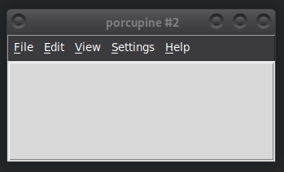
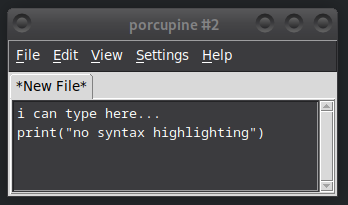

# Porcupine

Porcupine is an editor written with the notorious Tkinter library. It supports
most things you would expect from an editor, such as autocompletions and syntax
highlighting.

Most important features:
- Syntax highlighting (supports many programming languages
  and color themes, extensible)
- Autocompletions when pressing tab
- Jump to definition with Ctrl+click
- [Langserver] support
- [Editorconfig][] support
- Git support
- Compiling files inside the editor window
- Running files in a separate terminal or command prompt window
- Automatic indenting and trailing whitespace stripping when Enter is pressed
- Indent/dedent block with Tab and Shift+Tab
- Commenting/uncommenting multiple lines by selecting them and typing a #
- Highlighting matching parentheses
- Line numbers
- Line length marker
- Find/replace
- Code folding
- Multiple files can be opened at the same time like tabs in a web browser
- The tabs can be dragged out of the window to open a new Porcupine window conveniently

[Pygments]: https://pygments.org/
[Langserver]: https://langserver.org/
[Editorconfig]: https://editorconfig.org/

[Porcupine's design](dev-doc/architecture-and-design.md) makes it very easy to customize.
Almost everything is implemented as a plugin that can be disabled easily,
but if you know how to use Python and tkinter, you can also make your own plugins.
Porcupine plugins are so powerful that if you run Porcupine without any plugins, it looks like this:

## Installing Porcupine

Development Install

See [CONTRIBUTING.md](CONTRIBUTING.md) for development instructions.

Debian-based Linux distributions (e.g. Ubuntu, Mint)

Open a terminal and run these commands:

    sudo apt install python3-tk python3-pip python3-venv
    sudo apt install --no-install-recommends tkdnd    # for drop_to_open plugin
    python3 -m venv porcupine-venv
    source porcupine-venv/bin/activate
    pip install wheel
    pip install https://github.com/Akuli/porcupine/archive/v2026.02.16.zip
    porcu

To easily run porcupine again later,
go to *Settings* --> *Porcupine Settings*
and check "Show Porcupine in the desktop menu system".
This makes Porcupine show up in the menu just like any other application.

You can uninstall Porcupine by unchecking "Show Porcupine in the desktop menu system" in the settings
and then deleting `porcupine-venv`.

Other Linux distributions

Install Python 3.10 or newer with pip and tkinter somehow.
If you want drag and drop support, also install tkdnd for the Tcl interpreter that tkinter uses.
Then run these commands:

    python3 -m venv porcupine-venv
    source porcupine-venv/bin/activate
    pip install wheel
    pip install https://github.com/Akuli/porcupine/archive/v2026.02.16.zip
    porcu

To easily run porcupine again later,
go to *Settings* --> *Porcupine Settings*
and check "Show Porcupine in the desktop menu system".
This makes Porcupine show up in the menu just like any other application.

You can uninstall Porcupine by unchecking "Show Porcupine in the desktop menu system" in the settings
and then deleting `porcupine-venv`.

MacOS

I don't have a Mac. If you have a Mac, you can help me a lot by installing
Porcupine and letting me know how well it works.

I think you can download Python with tkinter from
[python.org](https://www.python.org/) and then run the commands for
"other Linux distributions" above.

Windows

Download a Porcupine installer from [the releases page](https://github.com/Akuli/porcupine/releases) and run it.
Because I haven't asked Microsoft to trust Porcupine installers,
you will likely get a warning similar to this one:

You should still be able to run the installer by clicking "More info".
When installed, you will find Porcupine from the start menu.

## Documentation

If you have just installed Porcupine, have a look at [user-doc/getting-started.md](user-doc/getting-started.md).
If you want to develop Porcupine, see [CONTRIBUTING.md](CONTRIBUTING.md) or [dev-doc/architecture-and-design.md](dev-doc/architecture-and-design.md).

Most of Porcupine's documentation is markdown files in two folders:
- [The `dev-doc` folder](./dev-doc/) contains the documentation for developing Porcupine.
- [The `user-doc` folder](./user-doc/) contains the documentation for using Porcupine.

## FAQ

### What's new in the latest Porcupine release?

See [CHANGELOG.md](CHANGELOG.md).

### Does Porcupine support programming language X?
You will likely get syntax highlighting without any configuring,
and autocompletions with a few lines of configuration file editing.
See [this documentation](user-doc/new-programming-language.md).

### Help! Porcupine doesn't work.
Please install the latest version.
If it still doesn't work, [let me know by creating an issue on
GitHub](https://github.com/Akuli/porcupine/issues/new).

### Is Porcupine written in Porcupine?

Yes. I wrote the very first version in `nano`, but Porcupine has changed a lot since.

### Why is it named Porcupine?

I think because I didn't find other projects named porcupine, but I don't remember exactly.
Originally, Porcupine was named "Akuli's Editor".

### I want an editor that does X, but X is not in the feature list above. Does Porcupine do X?
You can run Porcupine and find out,
or [create an issue on GitHub](https://github.com/Akuli/porcupine/issues/new) and ask.
If you manage to make me excited about X, I might implement it.

### Why did you create a new editor?
Because I can.

### Why did you create a new editor in tkinter?
Because I can.

### How does feature X work?
See [porcupine/](porcupine/)X.py or [porcupine/plugins/](porcupine/plugins/)X.py.

### Why not use editor X?
Because Porcupine is better.

### Is Porcupine based on IDLE?
Of course not. IDLE is an awful mess that you should stay far away from.

### Is Porcupine a toy project or is it meant to be a serious editor?
Porcupine is meant to be a serious editor, in fact you might regret even touching it.
https://www.youtube.com/watch?v=Y3iUoFkDKjU
