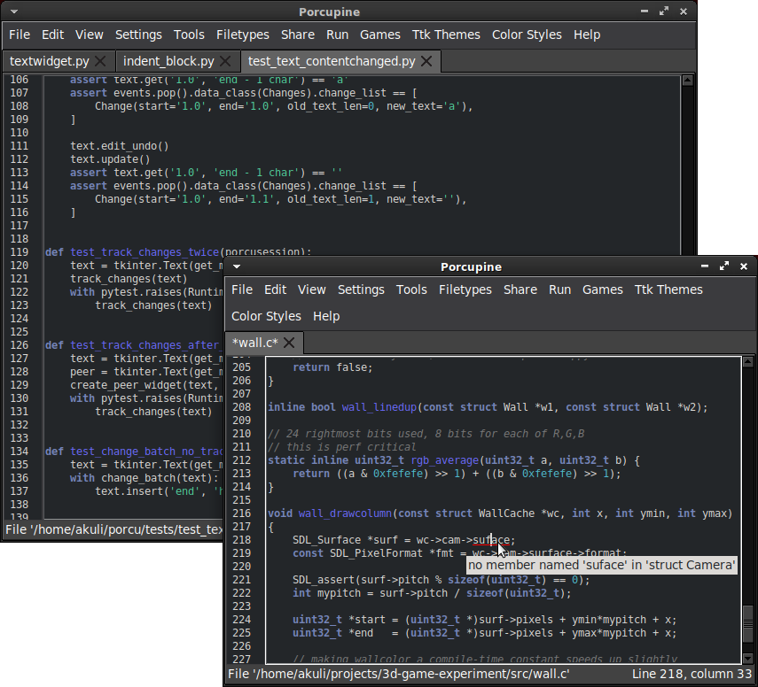
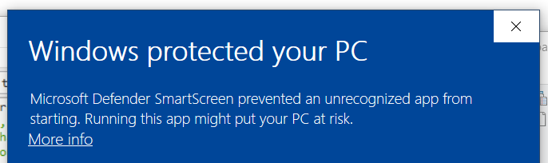

# Porcupine

Porcupine is an editor written with the notorious Tkinter library. It supports
most things you would expect from an editor, such as autocompletions and syntax
highlighting.

Most important features:
- Syntax highlighting with [Pygments][] (supports many programming languages
  and color themes, extensible)
- Autocompletions when pressing tab
- Jump to definition with Ctrl+click
- [Langserver] support
- [Editorconfig][] support
- Git support
- Compiling files inside the editor window
- Running files in a separate terminal or command prompt window
- Automatic indenting and trailing whitespace stripping when Enter is pressed
- Indent/dedent block with Tab and Shift+Tab
- Commenting/uncommenting multiple lines by selecting them and typing a #
- Highlighting matching parentheses
- Line numbers
- Line length marker
- Find/replace
- Code folding
- Multiple files can be opened at the same time like tabs in a web browser
- The tabs can be dragged out of the window to open a new Porcupine window conveniently

[Pygments]: https://pygments.org/
[Langserver]: https://langserver.org/
[Editorconfig]: https://editorconfig.org/

Porcupine also has [a very powerful plugin
API](https://akuli.github.io/porcupine/), and most of the above features are
implemented as plugins. This means that if you know how to use Python 3 and
tkinter, you can easily customize your editor to do anything you want to. In
fact, the plugin API is so powerful that if you run Porcupine without plugins,
it shows up as an empty window.

## Installing Porcupine

### Development Install

See [below](#developing-porcupine).

### Debian-based Linux distributions (e.g. Ubuntu, Mint)

Open a terminal and run these commands:

    sudo apt install python3-tk python3-pip
    sudo apt install --no-install-recommends tkdnd    # for drop_to_open plugin
    python3 -m pip install --user --upgrade pip wheel
    python3 -m venv porcupine-venv
    source porcupine-venv/bin/activate
    python3 -m pip install https://github.com/Akuli/porcupine/archive/v2022.07.31.zip
    porcu

If you want to leave Porcupine running and use the same terminal for something else,
you can use `python3 -m porcupine &` instead of `python3 -m porcupine`.
To run porcupine later, you need to activate the virtualenv before running it:

    source porcupine-venv/bin/activate
    porcu

You can uninstall Porcupine by deleting `porcupine-venv`.

### Other Linux distributions

Install Python 3.7 or newer with pip and tkinter somehow.
If you want drag and drop support, also install tkdnd for the Tcl interpreter that tkinter uses.
Then run these commands:

    python3 -m pip install --user --upgrade pip wheel
    python3 -m venv porcupine-venv
    source porcupine-venv/bin/activate
    python3 -m pip install https://github.com/Akuli/porcupine/archive/v2022.07.31.zip
    porcu

If you want to leave Porcupine running and use the same terminal for something else,
you can use `porcu&` instead of `porcu`.
To run porcupine later, you need to activate the virtualenv before running it:

    source porcupine-venv/bin/activate
    porcu

You can uninstall Porcupine by deleting `porcupine-venv`.

### Mac OSX

I don't have a Mac. If you have a Mac, you can help me a lot by installing
Porcupine and letting me know how well it works.

I think you can download Python with tkinter from
[python.org](https://www.python.org/) and then run the commands for
"other Linux distributions" above.

### Windows

Download a Porcupine installer from [the releases page](https://github.com/Akuli/porcupine/releases) and run it.
Because I haven't asked Microsoft to trust Porcupine installers,
you will likely get a warning similar to this one:

You should still be able to run the installer by clicking "More info".
When installed, you will find Porcupine from the start menu.

## FAQ

### What's new in the latest Porcupine release?

See [CHANGELOG.md](CHANGELOG.md).

### Does Porcupine support programming language X?
You will likely get syntax highlighting without any configuring
and autocompletions with a few lines of configuration file editing.
See [the instructions on Porcupine wiki](https://github.com/Akuli/porcupine/wiki/Getting-Porcupine-to-work-with-a-programming-language).

### Help! Porcupine doesn't work.
Please install the latest version.
If it still doesn't work, [let me know by creating an issue on
GitHub](http://github.com/Akuli/porcupine/issues/new).

### Is Porcupine written in Porcupine?

Yes. I wrote the very first version in `nano`, but Porcupine has changed a lot since.

### Why is it named Porcupine?

I think because I didn't find other projects named porcupine, but I don't remember exactly.
Originally, Porcupine was named "Akuli's Editor".

### I want an editor that does X, but X is not in the feature list above. Does Porcupine do X?
Maybe it can, see [the more_plugins directory](more_plugins/). If you don't
find what you are looking for, you can write your own plugin, or alternatively,
you can [create an issue on GitHub](https://github.com/Akuli/porcupine/issues/new)
and hope that I feel like writing the plugin for you.

### Why did you create a new editor?
Because I can.

### Why did you create a new editor in tkinter?
Because I can.

### How does feature X work?
See [porcupine/](porcupine/)X.py or [porcupine/plugins/](porcupine/plugins/)X.py.

### Why not use editor X?
Because Porcupine is better.

### Is Porcupine based on IDLE?
Of course not. IDLE is an awful mess that you should stay far away from.

### Is Porcupine a toy project or is it meant to be a serious editor?
Porcupine is meant to be a serious editor, in fact you might regret even touching it.
https://www.youtube.com/watch?v=Y3iUoFkDKjU

## Developing Porcupine

If you want to do something to Porcupine, that's awesome!
I have tried to make contributing easy:
- Some issues are labeled as "good first issue".
- If you don't understand what I meant in an issue, please ask me to clarify it.
    I have written most issues so that I understand what I wrote,
    and if you are new to Porcupine, you likely need a longer explanation to understand what the problem is.
- Don't worry about asking too many questions!
    It's not annoying. I like interacting with other programmers.
- There is not much boilerplate involved in the contributing process.
    You just create a pull request and that's it.
    You can choose an issue and start working on it, without prior permission.
    Instead of working on an issue, you can also create something that you would
    like to have in an editor.
- You don't need to read anything before you can get started.
    I recommend having a look at [the Porcupine plugin API docs](https://akuli.github.io/porcupine/),
    but that's not required.
- Don't worry too much about whether your code is good or not.
    I will review the pull requests and try to help you out.
    There are also checks running on GitHub Actions.

You can talk with me on GitHub issues,
or chat at [##learnpython on the libera IRC server](https://kiwiirc.com/nextclient/irc.libera.chat/##learnpython).
I am on ##learnpython at about 6PM to 9PM UTC.

To get started, make a fork of Porcupine with the button in the top right corner of this page.
Then install Python 3.7 or newer and [git](https://git-scm.com/), and run these commands:

    git clone https://github.com/YourUserName/porcupine
    cd porcupine
    python3 -m venv env
    source env/bin/activate
    pip install -r requirements.txt
    pip install -r requirements-dev.txt
    python3 -m porcupine

This should run Porcupine. If you change some of Porcupine's
code in the `porcupine` directory and you run `python3 -m porcupine` again, your changes
should be visible right away.

Windows-specific notes:
- You need to use `py` instead of `python3` when creating the venv,
    and `env\Scripts\activate` instead of `source env/bin/activate` to activate it.
- If creating the venv fails with an error message like `Error: [Errno 13] Permission denied: ...\\python.exe`,
    try creating the venv into a different folder.
    It is created into whatever folder you are currently `cd`'d to
    (i.e. the folder that shows up on the command prompt before the `>`).

Porcupine uses `mypy`, which is a tool that type-checks the code without running it.
Run it like this:

    mypy porcupine

It often points out problems like forgetting to check whether something is `None`.

Porcupine also uses `black` and `isort` to format code,
and you should run them after making changes.
For example, if you changed something in `porcupine/plugins/pastebin.py`, you would do:

    black porcupine/plugins/pastebin.py
    isort porcupine/plugins/pastebin.py

You can also just run `black porcupine` and `isort porcupine` to format everything.

If you forget to run `mypy`, `black` or `isort`, it doesn't matter.
GitHub Actions will let us know before I merge your PR.

After doing some development and closing the terminal that you set up the
environment in, you can go back to the environment by `cd`'ing to the correct
place and running `source env/bin/activate` again. You can run `deactivate` to undo
the `source env/bin/activate`.

Other commands you may find useful:
- `python3 -m pytest` runs tests. You will see lots of weird stuff happening
  while testing, and that's expected.
    A good way to debug a test to see what is actually going on is to add traces.
    It pauses the test to show you the current state of the program.
    - Use `import pdb` and `pdb.set_trace()` to set the pause points in the test. You can
      set as many as you like, and it can conveniently be done on one line: `import pdb; pdb.set_trace()`.
    - When the test pauses, type `cont` in terminal to continue the test.
    - If you at any time need to interact with the program during the pause,
      type `interact` in terminal. Exit interactive mode with `ctrl + D`.
- To see a report of test coverage, add `--cov=porcupine` to the above pytest
  command and then run `coverage html`. Open `htmlcov/index.html` in your favorite
  browser to view it.
- `cd docs` followed by `python3 -m sphinx . build` creates HTML documentation.
  Open `docs/build/index.html` in your favorite browser to view it.

## Releasing Porcupine

These instructions are meant for Porcupine maintainers.
Other people shouldn't need them.

1. Update `CHANGELOG.md` based on Git logs (e.g. `git log --all --oneline --graph`).
    You should add a new section to the beginning with `Unreleased` instead of a version number.
    Don't split the text to multiple lines any more than is necessary,
    as that won't show up correctly on GitHub's releases page.
2. Make a pull request of your changelog edits. Review carefully:
    changing the changelog afterwards is difficult, as the text gets copied into the releases page.
3. Merge the pull request and pull the merge commit to your local `master` branch.
4. Run `python3 scripts/release.py` from the `master` branch.
    The script pushes a tag named e.g. `v2022.07.31`,
    which triggers the parts of `.github/workflows/release-builds.yml`
    that have `if: startsWith(github.ref, 'refs/tags/v')` in them.
    They build and deploy docs, copy the changelog to the releases page, and so on.
5. Update `porcupine.wiki` if you added new features that are likely not obvious to users.

If you want, you can also do a release from a branch named `bugfix-release` instead of `master`.
This is useful if you fixed a bug that made Porcupine unusable for someone,
but the new features on `master` aren't ready for releasing yet.
