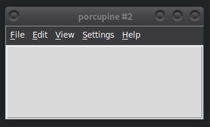
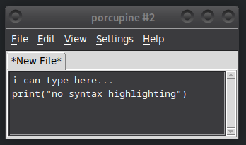

# Porcupine's Architecture and Design

**TL;DR:**
- core of Porcupine is small, and most of the functionality is in plugins
- plugins are loaded dynamically
- each plugin does a specific thing, and can be enabled/disabled individually by the user
- plugins can depend on each other when needed, and they pass messages to each other through virtual events.


## Small core, powerful plugins

Porcupine's architecture is super simple. There is:
- A **very minimal core** that provides only very basic functionality and can barely edit a text file.
- Lots of **plugins** that use the core to implement various things.

The core means everything except the plugins.

Plugins are just files in the `porcupine/plugins/` directory.
When Porcupine starts, it looks inside that directory and dynamically imports each file.
It then calls a function named `setup()` in each plugin.
(It is also possible to place plugins into one other directory, but most people should never need this feature.)

Basically, if something can reasonably be a plugin, it most likely is a plugin in Porcupine.
To get an idea of just how strongly Porcupine relies on plugins,
you can run it with all plugins disabled:

```
(env)$ python -m porcupine --no-plugins
```

It will look something like this:






## Pros and cons

The plugin-heavy design has many advantages:
- You don't usually need to read a lot of code to understand how something works.
    Instead, you study just one plugin, and at the time of writing this documentation,
    the average length of a plugin is only **167 lines**!
- Finding the buggy code is easy in Porcupine.
    If feature X doesn't work, it is most likely caused by `porcupine/plugins/X.py`.
- Most plugins are somewhat self-contained, so it's easy to understand how they work.
- Users can use the plugin manager to disable features they don't like,
    even if Porcupine developers didn't add something specifically to disable a feature.

And some disadvantages:
- The loading order (that is, order of calling `setup()` functions) matters.
- Some plugins need to communicate with each other, and it can get complicated.

Basically, because so much functionality is implemented as plugins,
the plugins depend on each other in various ways, and it can complicate things.
It also just doesn't feel right to many people, and I understand that.

That said, the plugin-heavy design works very well in practice.
This plugin system has made Porcupine much more successful than it would have been otherwise.
Even though there are lots of features, Porcupine is still very maintainable,
because it's easy to ignore a lot of code you don't care about.


## Loading Order

By default, Porcupine invokes the `setup()` functions
in alphabetical order when running normally, and in random order when running tests.

To control the order, plugins can define global variables named `setup_before` and `setup_after`.
Let's say you have `porcupine/plugins/foo.py` and `porcupine/plugins/bar.py`.
By default, the order will be alphabetical:

1. `bar.setup()`
2. `foo.setup()`

But if `foo.py` sets `setup_before = ["bar"]`, or if `bar.py` sets `setup_after = ["foo"]`, the order will be:

1. `foo.setup()`
2. `bar.setup()`

For example, the `filemanager` plugin adds things like "New file here" and "New directory here"
to the right-click menu you get from the directory tree on the left.
To do this, it accesses the directory tree in its `setup()`, so the `filemanager` plugin contains this line:

```
setup_after = ["directory_tree"]
```


## Communicating Between Plugins

Ideally, all plugins would be self-contained.
Each plugin would do its own thing, and the plugins wouldn't know anything about each other.
In practice, this isn't quite true.
For example, the `langserver` plugin needs to interact with many parts of Porcupine,
including several other plugins.

There are basically two ways how plugins can communicate with each other:
1. Importing a `get_foo()` function
2. Virtual events

A good example of importing a `get_foo()` function is the directory tree on the left.
The `directory_tree` plugin defines a function `get_directory_tree()` that returns the directory tree widget.
(It is an instance of a subclass of `tkinter.ttk.Treeview`.)
Other plugins (such as `filemanager` and `git_status`) then add more functionality to the directory tree.
To access it, they import the `get_directory_tree()` function from the `directory_tree` plugin and call it from `setup()`.

Virtual events are Porcupine's (and tkinter's) way to do callbacks.
If plugin A generates a virtual event on a widget,
and plugin B binds to that virtual event (in its `setup()`, for example),
then a callback function specified in plugin B will run whenever plugin A triggers the event.
This is useful, because plugin A can run code in plugin B without knowing anything about plugin B.
For more info about virtual events, see [virtual-events.md](virtual-events.md).

