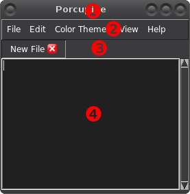

.. _plugin-intro:

Introduction to Writing Plugins
===============================

Porcupine is written in Python 3, and it can be extended a lot by writing
plugins for it in Python 3. Writing plugins is easy, but this tutorial and
Porcupine's API documentation assume
`basic tkinter skills <https://github.com/Akuli/tkinter-tutorial>`_.

.. TODO: add stuff like events and bindings to the tkinter tutorial?

.. warning::
    If you are an experienced tkinter user and you don't want to read this
    whole tutorial, read at least
    :ref:`the pitfall section <plugin-intro-pitfalls>`.

Where are the plugins?
----------------------

Porcupine searches for plugins in two places. The plugins that come with
Porcupine are installed along with it, but Porcupine also creates a user-wide
``plugins`` folder in its config directory. You can check where it is using
Python::

    >>> import porcupine.plugins
    >>> print(porcupine.plugins.__path__[0])
    /home/akuli/.config/porcupine/plugins

You can also use ``--print-plugindir`` as shown :source:`here <more_plugins/>`.

Of course, your plugins are probably not in ``/home/akuli/.config/porcupine/plugins``,
so you need to run the above commands yourself to find out where your plugins
should go. Rest of this tutorial calls this place **the plugin directory**.

Your plugin directory is empty by default. The plugins that come with Porcupine
are installed in a different place::

    >>> print(porcupine.plugins.__path__[1])
    /home/akuli/.local/lib/python3.7/site-packages/porcupine/plugins

Hello World!
------------

Create a ``hello.py`` to your plugin directory, and add this code to it::

    from tkinter import messagebox
    from porcupine import menubar

    def hello():
        messagebox.showinfo("Hello", "Hello World!")

    def setup():
        menubar.get_menu("Hello").add_command(label="Hello World", command=hello)

Restart Porcupine. You should see a new *Hello* menu in the menubar with a
*Hello World* button in it. Clicking that button runs the ``hello()``
function.

Some details:

    * ``menubar.get_menu("Hello")`` creates a :class:`tkinter.Menu` widget labelled
      *Hello* into the menubar and returns it. If there was already a menu labelled
      *Hello* in the menubar, then that would be returned instead. To create
      submenus instead, you can give a slash-separated string, such as
      ``"Tools/Python"`` for submenu menu named *Python* inside the *Tools* menu.
      See :mod:`porcupine.menubar` for more details.
    * Usually plugins are files, but directories with an ``__init__.py`` in them
      work as well.
    * Plugins can be imported like ``import porcupine.plugins.hello``.
      That's how Porcupine loads them.
    * File and directory names starting with ``_`` are ignored.
    * Each plugin must define a ``setup()`` function. If your plugin is a package,
      the ``setup()`` function must be exposed in ``__init__.py``. Porcupine calls
      this function on startup before opening any tabs.
    * Plugins are imported in an arbitary order, but you can control the order that
      the setup functions are called in. For example, you could add this code to
      ``hello.py``::

         setup_before = ['tabs2spaces']
         setup_after = ['fullscreen']

      Now our ``setup()`` function is guaranteed to be called before setting up
      :source:`tabs2spaces.py <porcupine/plugins/tabs2spaces.py>`, and
      :source:`fullscreen.py <porcupine/plugins/fullscreen.py>`'s ``setup()`` is
      always called before our ``setup()``.

A Step Back
-----------

Porcupine's plugin API is powerful, and many of Porcupine's features are
implemented as plugins. They come with Porcupine (see `Where are the plugins?`_
above), but you can also :source:`read them on GitHub <porcupine/plugins>`.

This tutorial is all about writing *more* plugins, but we'll start by running
Porcupine with *no* plugins at all just to get an idea of how much can be done
with plugins. Open a command prompt or terminal and run this command on it::

   porcu --no-plugins

If the ``porcu`` command doesn't work you can use ``pyw -m porcupine`` or
``python3 -m porcupine`` instead of ``porcu`` as shown in
`Porcupine's README <https://github.com/Akuli/porcupine#installing-porcupine>`_.

This will run Porcupine without any plugins, and it's a window with only the
menubar in it. You can still create and open files though.

Porcupine's Widgets
-------------------

Here are the widgets that Porcupine itself creates without any plugins:

.. the | character adds more whitespace between the image and the text below

|

.. |1| unicode:: \x2776
.. |2| unicode:: \x2777
.. |3| unicode:: \x2778
.. |4| unicode:: \x2778

|1| Main Window
   Everything is inside this widget. Usually it's a ``tkinter.Tk`` root window,
   but it might be a ``Toplevel`` widget in a future version of Porcupine. You
   can access this widget with :func:`porcupine.get_main_window`.

|2| Menu Bar
    You can access this widget with :func:`porcupine.menubar.get_menu`.

|3| Tab Manager
   This widget contains tabs (as in browser tabs, not ``\t`` characters), and
   :source:`the welcome plugin <porcupine/plugins/welcome.py>` displays a
   welcome message in it when there are no tabs. This widget is a
   :class:`porcupine.tabs.TabManager` and can be accessed with
   :func:`porcupine.get_tab_manager`.

|4| A Tab
   Tabs are :class:`porcupine.tabs.Tab` widgets, and you can access them with
   the tab manager's :attr:`tabs <porcupine.tabs.TabManager.tabs>` attribute.
   This tab is a :class:`porcupine.tabs.FileTab` because it represents a new
   file, but you can also create custom tabs that contain any tkinter widgets.
   See :mod:`porcupine.tabs` for more documentation about tabs.

.. _virtual-events:

Virtual Events
--------------

I added this short section here because not all tkinter users have seen virtual
events before. For example, code like this prints ``hi``::

   def print_hi(event):
       print("hi")

   some_widget.bind('<<PrintHi>>', print_hi)
   some_widget.event_generate('<<PrintHi>>')

Note that virtual event names must be between ``<<`` and ``>>``, just ``<`` and
``>`` are not enough. Porcupine generates some virtual events, and you can bind
to them in plugins.

Be careful to spell virtual event names correctly. We didn't really define the
``<<PrintHi>>`` event anywhere, so if we spell ``<PrintHi>>`` correctly in one
place and misspell it like ``<<PirntHi>>`` somewhere else we don't get any
errors.

.. _plugin-intro-pitfalls:

Potential Pitfalls
------------------

Most tkinter things work in Porcupine like you would expect them to work, but
there are a few things that you should be aware of.

Use add=True
^^^^^^^^^^^^

When you bind something that another plugin might need to bind as well, use the
``add=True`` argument to ``bind()``. For example, let's say you have something
like this::

   def callback1(event):
       print("lol")

   def callback2(event):
       print("wut")

   some_widget.bind('<Button-1>', callback1)
   some_widget.bind('<Button-1>', callback2)    # now clicking the widget doesn't print lol

**This code is bad!** Now ``callback1`` doesn't run at all because binding
``callback2`` discarded the old binding. Everything would be fine
if we had done this instead::

    some_widget.bind('<Button-1>', callback1, add=True)
    some_widget.bind('<Button-1>', callback2, add=True)
    # now they're both bound

Unfortunately tkinter's ``unbind()`` method is stupid and it unbinds
everything, regardless of the second argument passed into it (see
`the source code <https://github.com/python/cpython/blob/dff9b5f9d62a/Lib/tkinter/__init__.py#L1249>`_).

Binding Key Presses Globally
^^^^^^^^^^^^^^^^^^^^^^^^^^^^

If you want to bind a key press so that pressing it anywhere in Porcupine does something,
you should probably add a menu item for it with :mod:`porcupine.menubar`,
and then ask the users of the plugin to add the corresponding binding to their ``keybindings.tcl``.
This way, you allow the user of the plugin to decide
which key combination (if any) does your thing.

The user-specific ``keybindings.tcl`` can be edited by going to
*Settings* menu at top, then *Config Files*.
By default, it contains a link to Porcupine's ``default_keybindings.tcl`` in a comment,
and that contains many example key bindings.

Shift-Tab
^^^^^^^^^

A common thing to do in plugins is to bind something on the text widget of
every :class:`FileTab <porcupine.tabs.FileTab>`. The callbacks may
``return 'break'`` to prevent other plugins from handling the same event.

For example, if you're implementing an autocompleter plugin you might be
tempted to write this::

   from porcupine import tabs

   def on_tab(event):
       if we_can_complete():
           complete_next_alternative()

   def on_shift_tab(event):
       if we_can_complete():
           complete_previous_alternative()

   def on_new_tab(tab):
       if isinstance(tab, tabs.FileTab):
           tab.bind('<Tab>', on_tab)
           tab.bind('<Shift-Tab>', on_tab)

   # here's some code that runs on_new_tab() when a new tab is added

**This code is also bad!** First of all, it's not using ``add=True``, but
``<Shift-Tab>`` is also limited to Windows and OSX; it doesn't work at all on
Linux. What's more, any other plugins that handle Tab presses would get
notified of those tab presses that this plugin was able to autocomplete with
(except that they might not work at all because ``add=True`` wasn't used).

Let's fix this crap with ``add=True``, ``return 'break'`` and
:func:`porcupine.utils.bind_tab_key`::

   from porcupine import tabs, utils

   # this plugin handles all tab presses and returns 'break' from them, you
   # need this if you bind <Tab> on the text widget
   setup_before = ['tabs2spaces']

   def on_tab(event, shift_pressed):
       if we_can_complete():
           if shift_pressed:
               complete_previous_alternative()
           else:
               complete_next_alternative()
           return 'break'    # don't notify other plugins about this event
       else:
           return None    # let other plugins do whatever they want to

   def on_new_tab(tab):
       if isinstance(tab, tabs.FileTab):
           utils.bind_tab_key(tab, on_tab, add=True)

See :source:`porcupine/plugins/indent_block.py` for a complete example plugin.

Cleaning Up Bindings
--------------------

A binding like ``widget.bind('<Foo>', callback, ...)`` creates a Tcl command that runs
the Python ``callback`` function. By default, those Tcl commands are cleaned up when
``widget`` is destroyed. This is great for most bindings, because typically you want a
binding to be alive until the related widget is destroyed.

Avoid creating lots of bindings without cleaning them up properly. In particular, avoid
writing code that creates new bindings every time a user does something, but doesn't clean
up the old bindings when it does that.

For example, this code is **bad**::

    def callback_that_runs_when_user_does_something():
        for tag in list_of_tag_names:
            text_widget.tag_delete(tag)
        list_of_tag_names.clear()

        for index, thing in enumerate(something):
            tag = f'foo_{index}'
            text_widget.tag_bind(tag, ...)
            ...
            list_of_tag_names.append(tag)

If ``something`` is typically a sequence of 30 things and this callback runs 500 times for
the same ``text_widget``, then this creates 1500 new Tcl commands for the bindings, and
none of them get cleaned up before ``text_widget`` is destroyed. As a quick fix, you can
add some cleanup code::

    bindings = []

    def callback_that_runs_when_user_does_something():
        ...
        for binding in bindings:
            text_widget.deletecommand(binding)
        bindings.clear()

        for index, thing in enumerate(something):
            ...
            tcl_command = text_widget.tag_bind(tag, ...)
            bindings.append(tcl_command)
            ...

Now the bindings don't "pile up", and old bindings get cleaned up whenever new bindings
get added.

A "better" fix is to avoid running the same bind code multiple times.
For example, you could create one tag that includes all the bindings, and then apply two
tags in the loop, the ``f'foo_{index}'`` tag and the tag that does the bindings.
