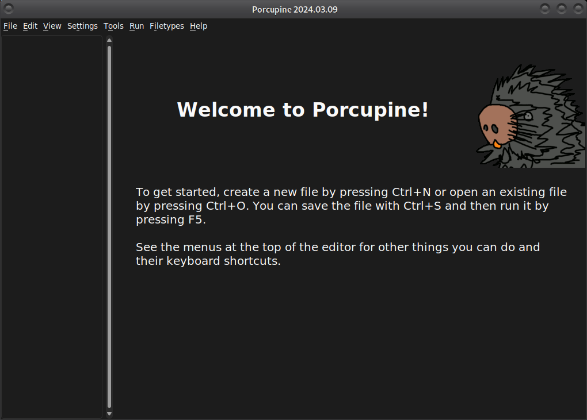
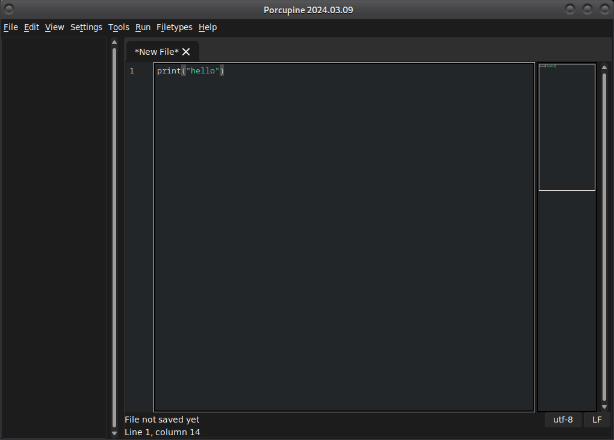
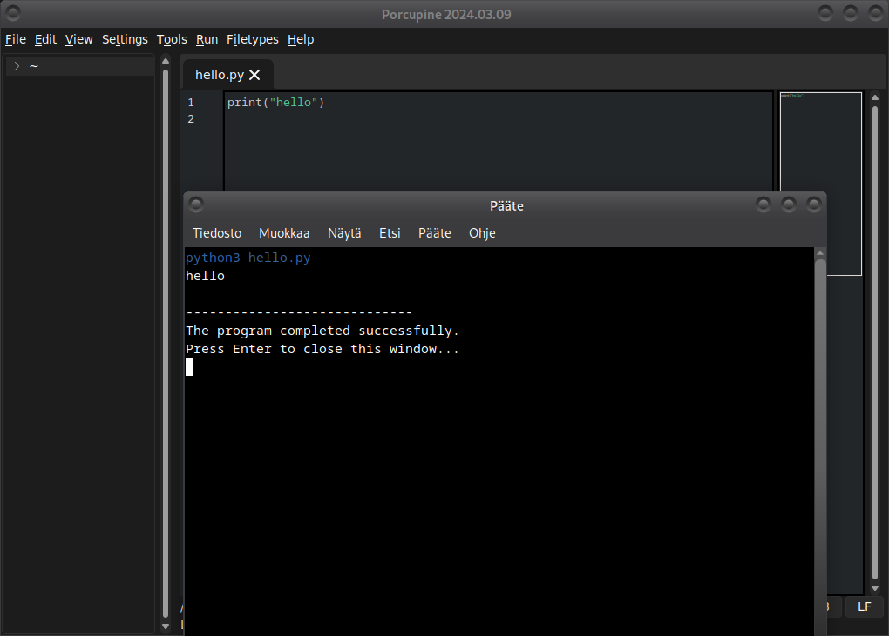
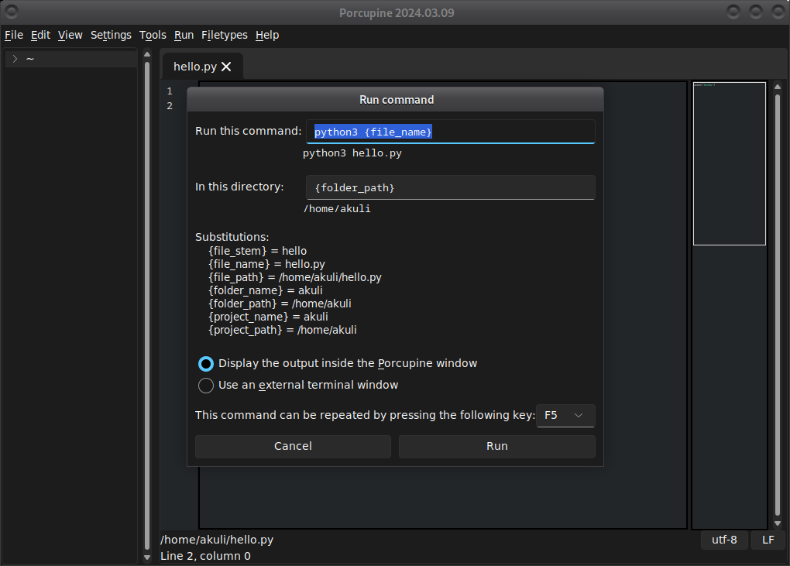
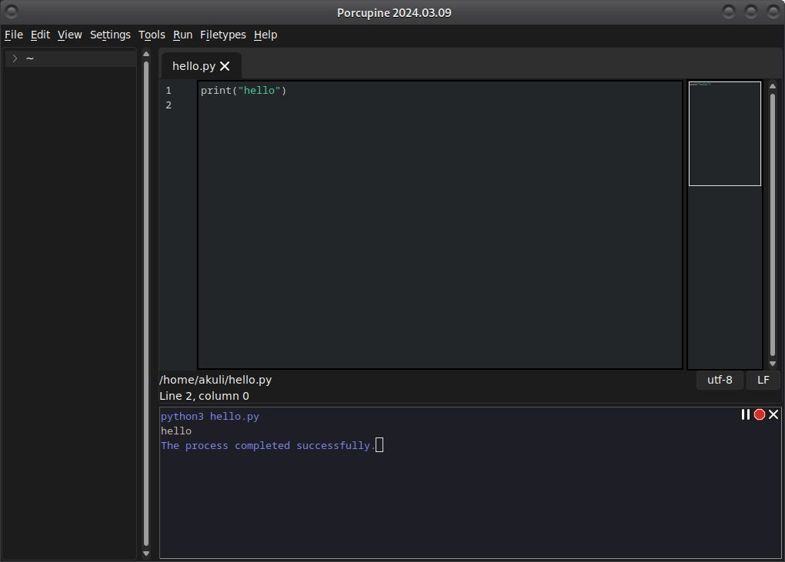

You have probably [installed Porcupine](https://github.com/Akuli/porcupine/#installing-porcupine).
Let's learn to use it!

## Hello World!

When you start Porcupine,
it looks roughly like this:

Let's press Ctrl+N like the welcome message suggest and write some code:

Note that the "New File" now has stars around it.
This is Porcupine's way to tell you that you haven't saved the file.

Save the file by pressing Ctrl+S. Porcupine will ask where you want to
save the file, and then the stars will disappear.
Porcupine also makes sure that you have one empty line at the end of the file,
because it's usually considered good practice.

Of course, Porcupine remembers where you saved the file,
so next time it will just save it without asking anything.

Let's run our code by pressing F5:

Running things in a terminal like this is not actually my idea.
I borrowed it from an editor called [Geany](https://geany.org/).

To configure how the program runs, you can press Shift+F5.
For example, you can select *Display the output inside the Porcupine window*
if you don't want a new terminal to pop up every time you run the program.

With output going to the Porcupine window, running the hello world program looks like this:

## The Menus

It's a good idea to browse the menus and see what they contain.
This way you'll find what you're looking for easily later.

Almost all menu buttons have nice keyboard shortcuts, like Ctrl+N and
Ctrl+S. If you find yourself opening something from a menu often,
I recommend using the keyboard shortcut instead.
That said, don't memorize keyboard shortcuts for things you almost never use.

Here are some of the most important things:

### "Report a problem or request a feature" in the Help menu

This button opens a browser window to create an issue on GitHub.
If you are new to Porcupine, you will probably have some problems getting started with it,
and you will probably discover some bugs.
Please tell me about them :)

### "Porcupine Settings" in the Settings menu

The most important setting is probably the color theme.
Unlike many other editors, Porcupine has a dark color theme by default.
Your eyes will thank you after programming for a few hours.
Porcupine comes with a few other color themes too, so you can choose whatever you want.

### "Plugin Manager" in the Settings menu

From a user's point of view, the plugin manager is an easy way to disable features you don't like.
Porcupine is designed so that almost anything can be disabled through the plugin manager.

For more information about plugins and Porcupine's design in
[dev-doc/architecture-and-design.md](../dev-doc/architecture-and-design.md).

### "Find and Replace" in the Edit menu

Porcupine's *Find and Replace* doesn't look particularly impressive,
but **it's one of my favorite things about Porcupine**.
It is full of little details that make it extremely fast to use once you've learned it,
but at the same time, every detail is intuitive and makes sense, at least to me.

Here's how to use it efficiently:

1. Select some text in your file (for example, by pressing arrow keys while holding down Ctrl and Shift).
2. Press Ctrl+F. This will open *Find and Replace* with the text you selected already in the *Find* entry.
    Also, all matches in the file are already highlighted.
3. Press Enter and Shift+Enter to select the match you care about.
    This does the same thing as clicking the *Next match* and *Previous match* buttons.
4. If you only want to find, not replace, press Esc. Porcupine will bring the cursor to the match you selected.
5. Press Alt+T to replace the selected match. To replace multiple matches, you can press Alt+T many times, or use Alt+A to replace all matches.
6. Press Esc. Porcupine will bring the cursor to the last match you selected.

Note that this requires relatively few key presses, and no mouse.
