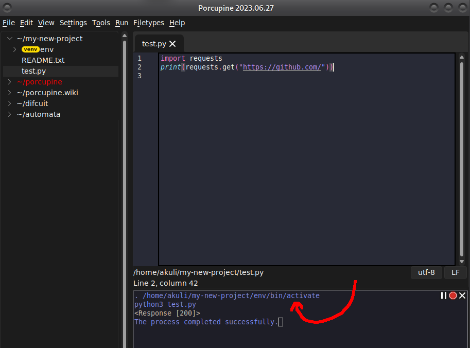

# Working with Python projects

For one-file scripts, you can just [make a new file and run it](getting-started.md).
This project explains the recommended way to work with larger projects.


## Project Root and Directory Tree

After downloading a project you want to work on (with e.g. `git clone`),
just open any file from the project in Porcupine.
The directory tree at left will look something like this:


Each item in the directory tree represents **project root folder**.
This is the folder where all files related to that project will go.
For projects that use Git, this folder is usually created by running `git clone` on terminal.
The `~` characters means your home folder.
It is typically `C:\Users\YourName` on Windows, `/Users/YourName` on MacOS and `/home/yourname` on Linux.
For example, on my computer, `~/porcupine` actually means `/home/akuli/porcupine`.

Double-click the project root folder in the directory tree to have a look inside.
You will see the files in the project.
After working on a project for a while, the directory tree will look something like this:


Colors appear only in projects that use Git.
The meanings of the colors are similar to `git status`:
- Green = these changes have been `git add`ed, and they will be included in the next Git commit
- Bright red = these changes won't be included in the next Git commit unless you `git add` them
- Dark red = this is a new file that Git knows nothing about
- Gray = this file or folder has been ignored using `.gitignore` and isn't meant to be committed


## Project Root Detection

Currently the logic for finding the project root is:
1. If the file is inside a Git repository (e.g. created by `git clone`),
    then the Git repository becomes the project root.
    For example, I am currently editing `/home/akuli/porcupine/user-doc/projects.md`,
    and Porcupine has detected `/home/akuli/porcupine` as the project root
    because it is a Git repository.
2. If Git isn't used but there is a README or [`.editorconfig` file](https://editorconfig.org/),
    then the project root is the folder where the README or `.editorconfig` is.
    (Porcupine supports editorconfig files.)
    Porcupine recognizes several different capitalizations and file extensions, such as README.md, ReadMe.txt and readme.rst for example.
    So even if your project doesn't use Git, Porcupine is still likely to recognize it correctly.
3. If all else fails, the directory containing the file is used.
    This is why `~` and `/tmp` show up as projects for me.
    I have edited a couple scripts that have been saved to those folders.

If all else fails, the directory containing the file is used as the project root.


## Virtual environments, aka venvs

This section only applies to Python projects.

Any large Python project has many dependencies.
You could just `pip install` them all into your system, but:
- When you no longer want to work on a project, there's no good way to uninstall the dependencies of that project.
- If `pip` doesn't work for whatever reason, you will probably have the same problem in all projects.
- Different projects might need different, incompatible versions of the same dependency.

Venvs fix these problems.
A venv is a folder that contains all your dependencies,
and prevents you from polluting your system's Python with libraries.
If you no longer want to work on a project, just delete the venv folder.

I recommend making one venv for each project that has dependencies.

To create a venv, start by opening a terminal in the project root folder.
For example, you can right-click the project root in Porcupine and select *Open in terminal*.


Let's create a venv named `env`, activate it, and install a library into it:

```
$ python3 -m venv env
$ source env/bin/activate
(env)$ pip install requests
```

This should look something like this:


If you are on Windows,
use `py` instead of `python3` and `env\scripts\activate` instead of `source env/bin/activate`.

Activating the venv means that `pip`, `python` and other commands point to things inside the venv.
So if you say `pip` with a venv activated, you are running the venv's pip.
It installs everything into the venv, not globally.

Now go back to Porcupine. You should see a new folder named `env` with a  next to it.
This means that Porcupine found your venv and will use it.
If Porcupine doesn't find your venv, or you have multiple venvs and Porcupine uses the wrong one,
you can choose the venv to use by right-clicking it:


Let's [create and run a file](getting-started.md) that uses `requests`.
You will see that Porcupine activates the venv before it invokes Python to run the file:


